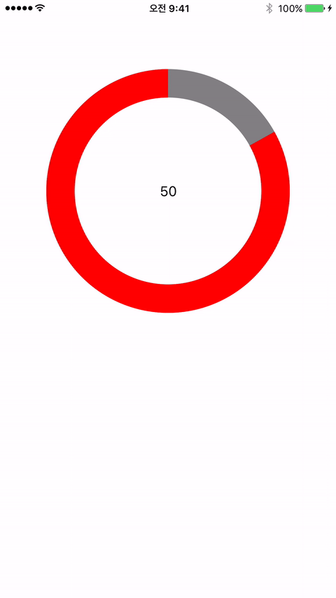

MJCircleCounter is a simple time Counter.



# MJCircleCounter

[](https://travis-ci.org/minjoongkim/MJCircleCounter)
[](http://cocoapods.org/pods/MJCircleCounter)
[](http://cocoapods.org/pods/MJCircleCounter)
[](http://cocoapods.org/pods/MJCircleCounter)

## Example

To run the example project, clone the repo, and run `pod install` from the Example directory first.

## Requirements

## Installation

MJCircleCounter is available through [CocoaPods](http://cocoapods.org). To install
it, simply add the following line to your Podfile:

```ruby
pod "MJCircleCounter"
```


Then, simply place this line in any file that uses MJCircleCounter.

```objc
#import <MJCircleCounter.h>
```

MJCircleCounter works on iOS 6.0 and up.

## Usage

###Example usage: *.h

```objc
#import "MJCircleCounter.h"

@interface MJCircleCounterViewController : UIViewController <MJCircleCounterDelegate>

@property (retain, nonatomic) IBOutlet MJCircleCounter *circleCounter;
@property (retain) IBOutlet UILabel *lbl_second;


```

###Example usage: *.m

```objc
- (void)viewDidLoad
{
    [super viewDidLoad];
    // Do any additional setup after loading the view, typically from a nib.
    
    _circleCounter.delegate = self;
    _circleCounter.timerLabel = _lbl_second;
    
    [self.circleCounter startWithSeconds:60 remainTime:0];

}

```


## Author

minjoongkim, kmj6773@gmail.com

## License

MJCircleCounter is available under the MIT license. See the LICENSE file for more info.
